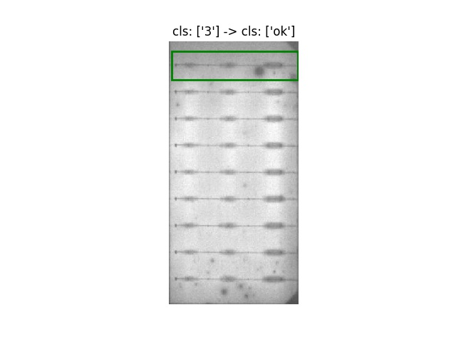
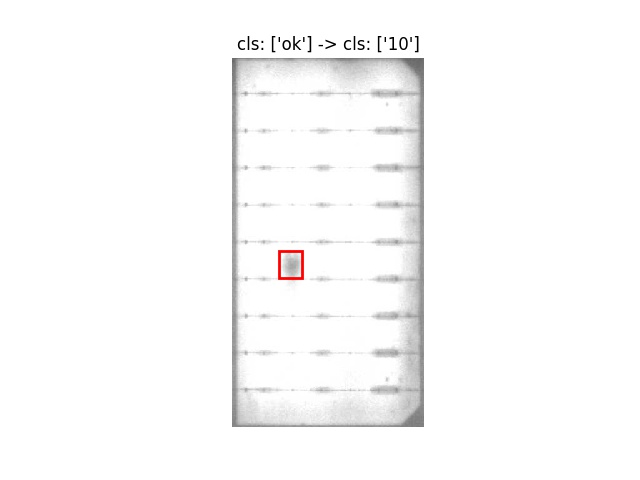
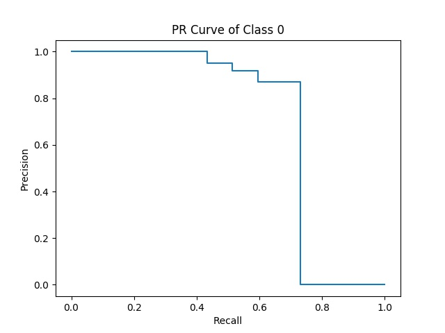
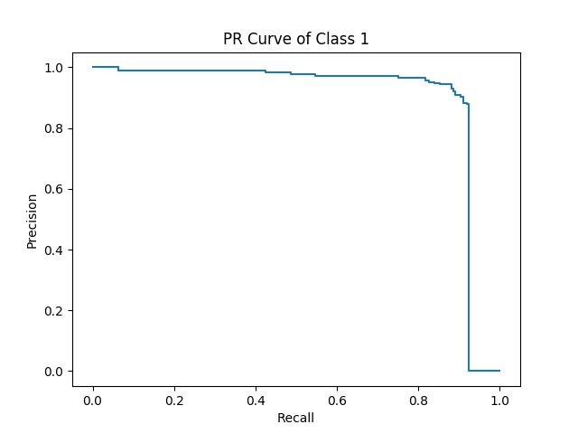
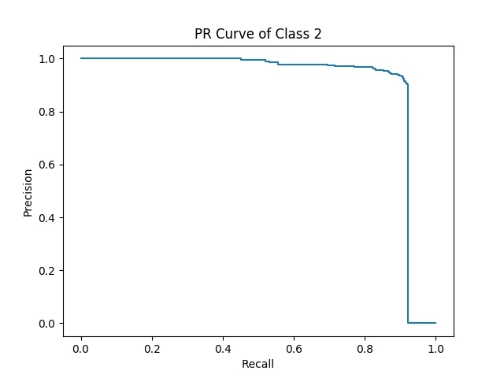
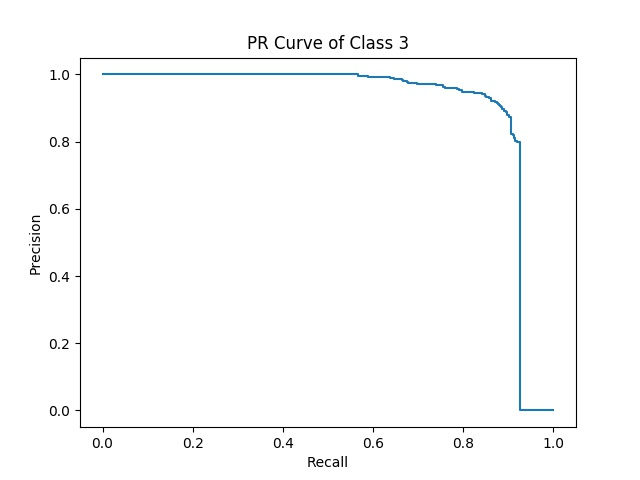
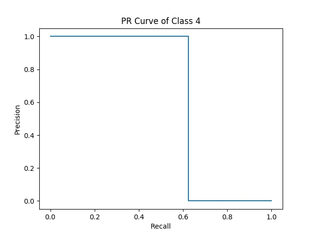
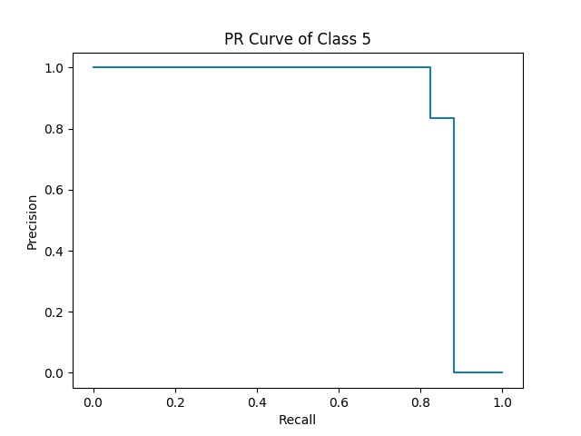

# 1. 功能描述

该仓库主要实现对目标检测算法的评价，含AP、P@R、PR曲线、漏报+误报。主要优势：1）操作简单，具体使用方法见下文；2）评估速度快，比如计算2000张图片的AP，总耗时不到0.3秒。

注意：此处AP的计算和学术界目标检测的AP计算方法稍微有点不同，学术界目标检测的AP计算是不考虑OK样本的，但是该仓库中考虑了。


# 2. 代码结构

```python
class DetectorEval(object):
    def __init__(self, y_true, y_pred, binary_mode, iou, score):
        XXX
    def compute_ap(self):
        XXX
    def compute_p_at_r(self, recall_thresh=0.995):
        XXX
    def draw_pr_curve(self, output_dir='pr_curve'):
        XXX
    def compute_fnr_and_fpr(self, fail_study=False):
        XXX
    def draw_failure_cases(self, img_path_list, fn_index_list, fp_index_list, label_map=None, res_dir):
        XXX
```

具体函数解释、参数含义、返回值等见代码中的注释。


# 3. 使用方法

## 3.1 评估两类结果（所有缺陷合并为1类）

需要指定binary_mode为True。

```python
det_eval = DetectorEval(gt, res, binary_mode=True, iou=0.3, score=0.1)
ap_res = det_eval.compute_ap()
print('ap res is: ', ap_res)
lw_res, fn_ind_list, fp_ind_list = det_eval.compute_fnr_and_fpr(fail_study=True)
print('lw res is: ', lw_res)
det_eval.draw_failure_cases(img_path_list, fn_ind_list, fp_ind_list, label_map={0:'0', 1:'1', 2:'2', 3:'3', 4:'8', 5:'10'}, res_dir='failure_cases/'+model)
```

输出结果如下：

ap res is:  [{'class_id': 1, 'ap': 0.9402}]
lw res is:  {'fnr': 0.0237, 'fpr': 0.0033}

输出的failure case如下：

<center>
	
	
</center>

左边为漏报图片示例，右边为误报图片示例。


## 3.2 评估多类结果

需要指定binary_mode为False。

```python
det_eval = DetectorEval(gt, pred, binary_mode=False, iou=0.1, score=0.1)
ap_res = det_eval.compute_ap()
p_at_r = det_eval.compute_p_at_r()
print('ap res is: ', ap_res)
print('p_at_r res is: ', p_at_r)
det_eval.draw_pr_curve(output_dir='pr_curve')

```

输出结果如下：

ap res is:  [{'class_id': 0, 'ap': 0.7015}, {'class_id': 1, 'ap': 0.9024}, {'class_id': 2, 'ap': 0.9083}, {'class_id': 3, 'ap': 0.9097}, {'class_id': 4, 'ap': 0.625}, {'class_id': 5, 'ap': 0.8725}]
p_at_r res is:  [{'recall': 0.7297, 'precision': 0.871, 'class_id': 0}, {'recall': 0.9237, 'precision': 0.879, 'class_id': 1}, {'recall': 0.9213, 'precision': 0.903, 'class_id': 2}, {'recall': 0.9268, 'precision': 0.7988, 'class_id': 3}, {'recall': 0.625, 'precision': 1.0, 'class_id': 4}, {'recall': 0.8824, 'precision': 0.8333, 'class_id': 5}]

保存图片如下：

<center>
	
	
	
	
	
	
</center>

